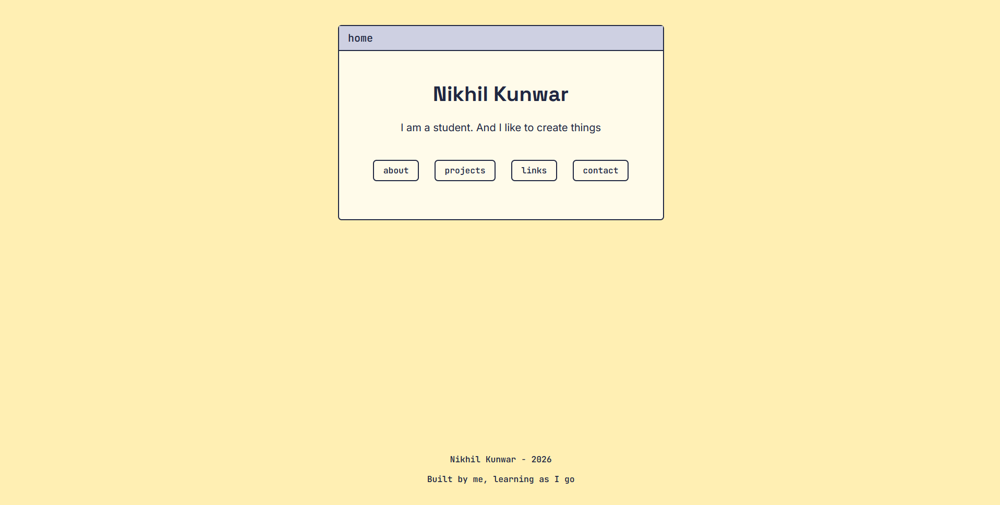
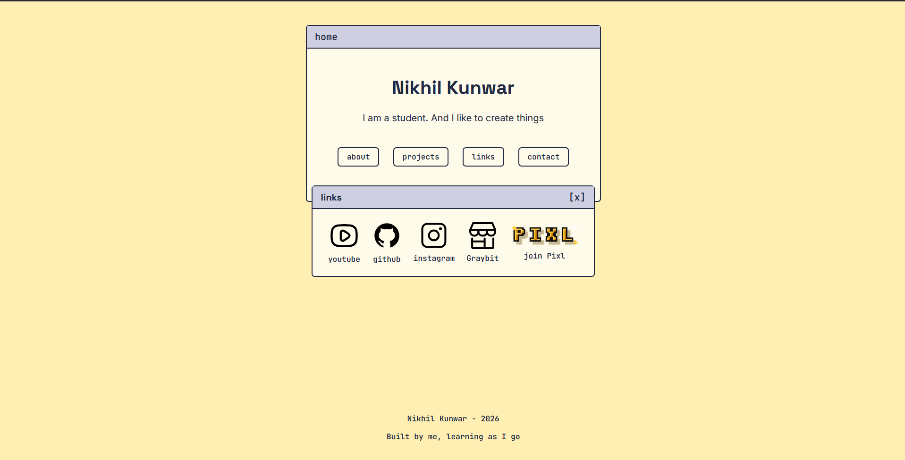
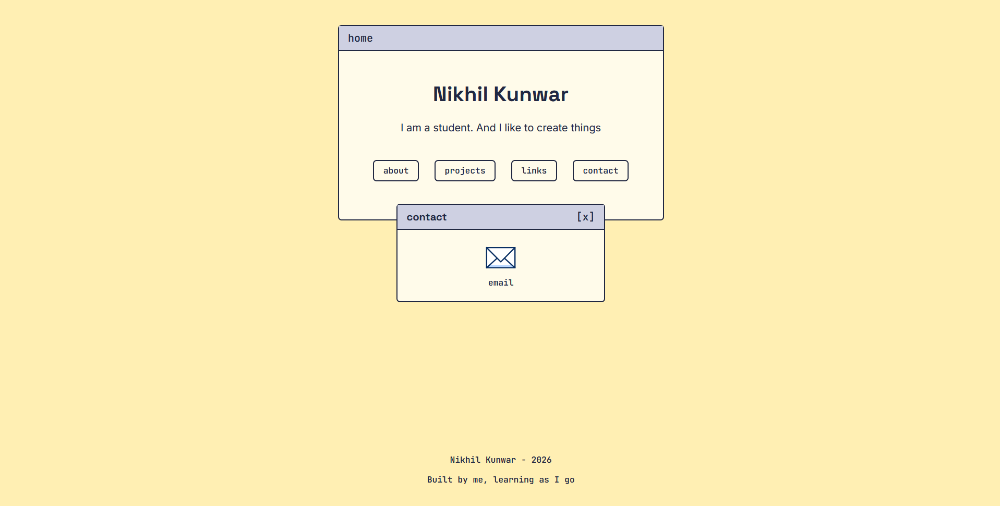
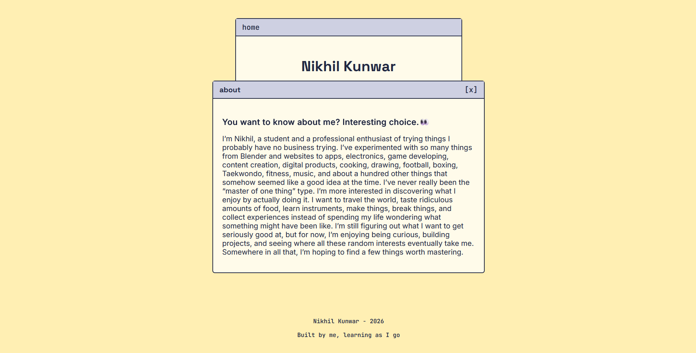
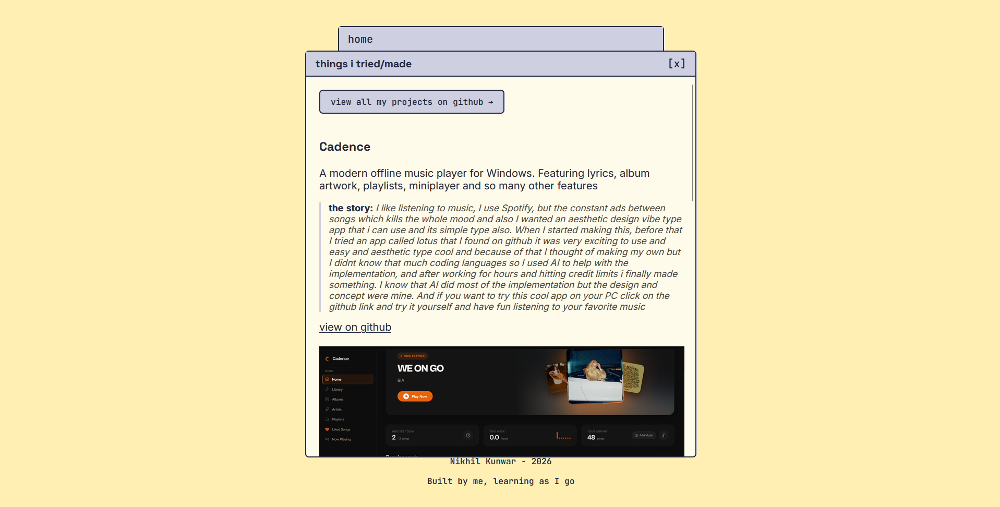

# Nikhil Kunwar — Personal Builder Page
A personal site that I built for Pixl's "Raise your Builder Page" trial. It introduces me, links to what I've made, and gives a way to reach me.

**check out the [Live Website](https://nikhilkshub.github.io/raise-your-builder-page/)**

## What it is
A single page personal site styled like a small desktop, click "about," "projects," "links," or "contact" and a window opens over the home screen. About containing content that introduces me , Projects contains the project i made with a GitHub link all to view all the projects , Links contain all the links related to me like Instagram , YouTube , GitHub , my digital store and other and then the Contact contains the Email me option 

## Built with
- Plain HTML5 and CSS3 and nothing else
- Google Fonts that i used: Space Grotesk, Inter, JetBrains Mono
- The window-opening behavior uses CSS `:target`, not JavaScript

## How to run it locally
No install or build step needed, since it's static HTML/CSS.
1. Clone the repo
2. Open `index.html` directly in a browser.
Though, I highly doubt you’ll ever actually need to run my personal site on your own machine...

## Screenshots
**Instead of looking at screenshots, check out the live site yourself to see how it's made!**

### Homepage

### Links

### Contact

### About

### Projects

## Built with AI assistance — here's exactly how
Specifically:
**Concept and layout decisions** (the desktop/window idea, color palette, typography) were mine, developed through back-and-forth discussion and so many online inspirations 
**CSS concepts were explained to me** (flexbox, the box model, `:target`, pseudo-elements) and I wrote the actual code myself based on those explanations
**Debugging help** when things weren't working (e.g. a flexbox sizing quirk with `max-width`)
**Wording feedback** on a few lines of copy (the About page intro, project descriptions)
 
Everything in this repo's HTML/CSS, I wrote by hand and understand line by line — Claude explained concepts and caught bugs, it didn't generate the files for me.
